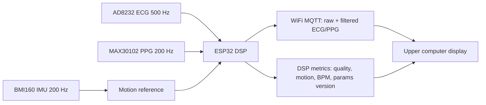

# Edge DSP Algorithms and Tuning Guide

This document describes the DSP path used by the cardio monitor demo. The goal is stable demonstration and easy tuning, not medical-grade diagnosis.

## 1. Runtime Data Flow

IMU is not a real-time waveform output channel. It is used locally on the ESP32 to estimate motion and to drive PPG adaptive filtering and signal quality.

## 2. ECG Processing

Default chain:

1. High-pass baseline removal: default `0.5 Hz`.
2. Optional 50 Hz notch: default enabled, `Q = 30`.
3. Low-pass noise suppression: default `38 Hz`.
4. Simple R-peak demonstration detector: squared slope plus dynamic threshold.
5. Lead-off handling: quality is lowered and peak state is not updated.

Suggested tuning:

| Parameter | Default | Tune when |
| --- | ---: | --- |
| `ecgHighpassHz` | `0.5` | Baseline drift is visible. Raise slowly to `0.8-1.0`; lower if ST/T shape is distorted. |
| `ecgLowpassHz` | `38` | High-frequency noise remains. Lower to `30-35`; raise if QRS looks too rounded. |
| `ecgNotchEnabled` | `true` | Disable if analog front-end already removes mains hum cleanly. |
| `ecgNotchQ` | `30` | Lower Q widens suppression but may distort waveform; higher Q is gentler. |
| `ecgPeakThreshold` | `0.22` | Increase if false R peaks appear; decrease if beats are missed. |

ECG adaptive filtering is intentionally off by default. ECG morphology is easy to damage, so motion mainly lowers quality instead of aggressively subtracting IMU reference.

## 3. PPG Processing

Default chain:

1. High-pass DC removal: default `0.35 Hz`.
2. Low-pass smoothing: default `7 Hz`.
3. IMU-NLMS adaptive artifact reduction for IR and RED.
4. Pulse-rate demonstration detector.

Suggested tuning:

| Parameter | Default | Tune when |
| --- | ---: | --- |
| `ppgHighpassHz` | `0.35` | Raise if slow drift dominates; lower if pulse baseline becomes unstable. |
| `ppgLowpassHz` | `7` | Lower if noisy; raise if pulse peaks are over-smoothed. |
| `nlmsTaps` | `8` | Increase to `12-16` for slower motion artifact; lower if response is unstable. |
| `nlmsStep` | `0.02` | Increase for stronger correction; lower if waveform shakes or inverts. |
| `nlmsEpsilon` | `0.001` | Raise slightly if the filter becomes numerically jumpy. |
| `motionThreshold` | `650` | Set from real IMU data; motion above this lowers quality and drives filtering. |

The filtered PPG is shifted to a display-friendly range before transmission. It is for visual comparison and tuning, not calibrated optical measurement.

## 4. IMU Motion Reference

The firmware computes:

1. Acceleration magnitude: `sqrt(ax^2 + ay^2 + az^2)`.
2. High-pass removal of gravity/slow posture.
3. Low-pass envelope as `motionLevel`.

Use the tuning tool to load a CSV containing ECG/PPG/IMU. Choose a quiet segment and a motion segment. Set `motionThreshold` slightly above the quiet segment maximum and below the motion segment median.

## 5. Tuning Workflow

1. Record a short sample with three parts: still, mild motion, stronger motion.
2. Open `flutter/dsp_debug_web`.
3. Import CSV with columns for timestamp, ECG, PPG IR, PPG RED, and IMU axes.
4. Tune ECG first with IMU/NLMS ignored: baseline, notch, low-pass, R peaks.
5. Tune PPG filters without over-smoothing pulse peaks.
6. Tune `motionThreshold`, then `nlmsStep`, then `nlmsTaps`.
7. Export JSON for a control command or copy the C++ parameter block into firmware defaults.
8. Re-test live WiFi demo and watch DSP metrics: motion, quality, BPM, params version.

## 6. Analog Front-End Notes

The system already has analog circuits, so digital filters should be conservative.

- If ECG baseline is already stable, keep high-pass near `0.3-0.5 Hz`.
- If mains hum is already removed, disable the notch to avoid ringing.
- If PPG peaks become flat, raise `ppgLowpassHz` or reduce NLMS step.
- If filtered output looks delayed, reduce smoothing and NLMS taps.
- If movement is too strong, prefer lowering quality instead of forcing a clean waveform.

## 7. Acceptance Criteria

- WiFi does not output IMU six-axis waveforms.
- Upper computer can show raw and filtered ECG/PPG at the same time.
- Still segments have high quality and stable waveform.
- Motion segments raise `motionLevel` and lower PPG quality.
- PPG filtered waveform is visually less affected by motion than raw PPG.
- Parameter changes can be exported from the tuning tool and applied through control or firmware defaults.
