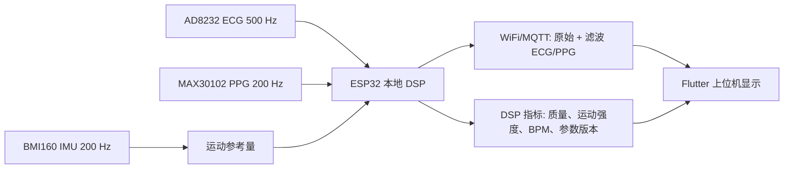

# 边缘 DSP 算法与调参说明

本文说明当前系统新增的数字信号处理链路。目标是课程设计/功能演示中的稳定展示和便捷调参，不作为医学诊断算法说明。

## 1. 总体数据流

IMU 六轴数据默认不作为实时波形输出。它只在 ESP32 本地用于估计运动强度，并参与 PPG 的运动伪影抑制。

## 2. ECG 处理链路

默认处理顺序：

1. 高通滤波去基线漂移，初值 `0.5 Hz`。
2. 50 Hz 陷波，默认开启，`Q = 30`。
3. 低通滤波抑制高频噪声，初值 `38 Hz`。
4. 简化 R 峰检测，用于演示心率估计。
5. lead-off 时降低 ECG 质量分，不更新峰值状态。

常用参数：

| 参数 | 默认值 | 调参建议 |
| --- | ---: | --- |
| `ecgHighpassHz` | `0.5` | 基线漂移明显时可升到 `0.8-1.0`；如果 ST/T 波形被削弱则降低。 |
| `ecgLowpassHz` | `38` | 高频噪声明显时降到 `30-35`；QRS 过圆钝时升高。 |
| `ecgNotchEnabled` | `true` | 如果模拟前端已经充分抑制工频干扰，可以关闭。 |
| `ecgNotchQ` | `30` | Q 越低抑制范围越宽，但更容易改变波形；Q 越高越温和。 |
| `ecgPeakThreshold` | `0.22` | 误检 R 峰时增大；漏检时减小。 |

当前 ECG 默认不做 IMU 自适应滤波。原因是 ECG 形态更容易被过度滤波破坏，演示中优先用常规滤波和质量降权保持稳定。

## 3. PPG 处理链路

默认处理顺序：

1. 高通去 DC/慢漂移，初值 `0.35 Hz`。
2. 低通平滑，初值 `7 Hz`。
3. IMU-NLMS 自适应滤波，分别处理 IR 和 RED。
4. 简化脉搏峰检测，用于演示脉率估计。

常用参数：

| 参数 | 默认值 | 调参建议 |
| --- | ---: | --- |
| `ppgHighpassHz` | `0.35` | 慢漂移明显时升高；脉搏基线变乱时降低。 |
| `ppgLowpassHz` | `7` | 毛刺多时降低；脉搏峰被压平时升高。 |
| `nlmsTaps` | `8` | 运动伪影变化慢时可升到 `12-16`；不稳定时降低。 |
| `nlmsStep` | `0.02` | 抑制不够时增大；波形抖动、翻转或过冲时减小。 |
| `nlmsEpsilon` | `0.001` | 数值不稳定时略微增大。 |
| `motionThreshold` | `650` | 需要用真实 IMU 数据调出来，不建议长期直接用默认值。 |

PPG 滤波输出会平移到适合显示的范围，主要用于视觉对比和调参，不代表校准后的光学物理量。

## 4. IMU 运动参考

固件本地计算流程：

1. 加速度模长：`sqrt(ax^2 + ay^2 + az^2)`。
2. 高通去掉重力和姿态慢变化。
3. 低通得到平滑的 `motionLevel`。

调参时建议录一段包含“静止、轻微运动、明显运动”的 CSV。打开调参工具后观察 `Motion reference`，把 `motionThreshold` 设置在静止段最大值以上、运动段中间值以下。

## 5. 推荐调参流程

1. 先录制一段短数据：静止 10 秒、轻微运动 10 秒、明显运动 10 秒。
2. 打开 `flutter/dsp_debug_web` 调参工具。
3. 导入 CSV，确认 ECG、PPG IR、PPG RED、IMU 轴映射正确。
4. 先调 ECG：基线、工频、低通、R 峰阈值。
5. 再调 PPG：高通、低通，避免把脉搏峰抹平。
6. 最后调 IMU-NLMS：先 `motionThreshold`，再 `nlmsStep`，再 `nlmsTaps`。
7. 导出 JSON，通过 MQTT/BLE control 下发；或复制 C++ 参数块写回固件默认参数。
8. 回到上位机 WiFi 演示，观察原始/滤波 ECG/PPG 和 DSP metrics。

## 6. 模拟前端已存在时的注意事项

你的系统已经有模拟电路，因此数字滤波不要太激进：

- ECG 基线已经稳定时，高通保持在 `0.3-0.5 Hz`。
- 工频干扰不明显时，优先关闭 notch，避免陷波振铃。
- PPG 脉搏峰变平时，升高 `ppgLowpassHz` 或降低 `nlmsStep`。
- 滤波后延迟明显时，减少平滑和 NLMS taps。
- 运动特别强时，不要强行滤干净，优先降低质量分，保证演示波形不乱跳。

## 7. 验收标准

- WiFi 模式不输出 IMU 六轴波形。
- 上位机可以同时显示原始和滤波后的 ECG/PPG。
- 静止段质量分高，波形稳定。
- 运动段 `motionLevel` 上升，PPG 质量分下降或自适应滤波效果明显。
- 调参工具可以导入 CSV、调整参数、导出 JSON/C++ 参数。
- 参数下发后，固件 metrics 中的 DSP 参数版本发生变化。
