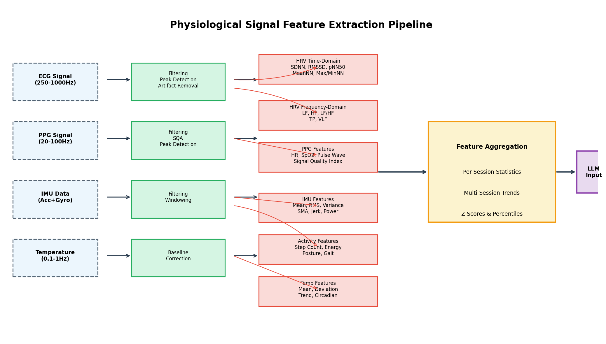
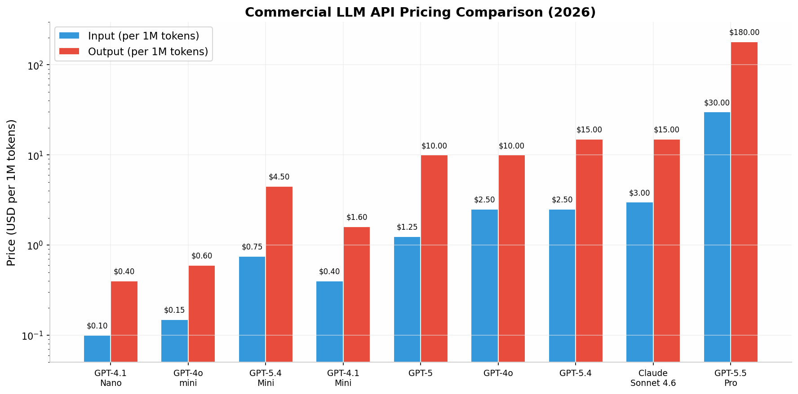

好的，针对您的项目——基于ESP32与多传感器（温度、ECG、PPG、IMU）采集生理信号，并通过商业LLM API生成健康监测报告——本报告从**模型选型**与**数据输入策略**两大核心问题出发，提供可直接落地的技术方案。

简要结论如下：在模型选择上，**GPT-4o或GPT-5**（OpenAI）以及**Claude Sonnet 4.6**（Anthropic）是综合性能与合规性的首选；在数据输入形式上，**绝对不应直接输入原始数据点**，最佳实践是在上位机或边缘端完成**特征提取（Feature Engineering）**，将各信号的统计特征（如HRV的SDNN/RMSSD、IMU的RMS/SMA等）组织成**结构化文本或JSON格式**，再输入大模型生成报告。这种方案在成本、延迟和模型理解度上均最优。

---

# 基于ESP32多传感器生理信号采集的LLM医疗报告生成方案调研

**报告日期**: 2026年05月19日

## 1. 适合健康/医疗分析任务的LLM API选型

将生理信号数据交由大语言模型（LLM）分析并生成医疗报告，首要任务是选择一个在医学知识、推理能力和API可用性上均表现优异的模型。由于您的项目以**健康监测为主、专业分析为辅**，且需要调用商业API，本节将从医疗基准性能、模型特性、API成熟度及合规性四个维度，对当前主流的商业LLM进行综合评估。核心结论表明，**OpenAI的GPT-4o/GPT-5系列**和**Anthropic的Claude Sonnet 4.6**是当前最适合该任务的模型，它们在医学考试基准测试中表现卓越，且均提供了符合HIPAA要求的API服务路径。Google的Med-Gemini在特定医学影像任务上有优势，但通用健康文本分析能力与前两者相当。选择时还需权衡成本、长文本处理能力和多模态支持等工程因素。

### 1.1 核心模型推荐：GPT-4o / GPT-5 (OpenAI)

OpenAI的GPT系列模型在医疗健康领域的表现一直处于行业领先地位。其最新的**GPT-5模型在MedQA（美国医师执照考试USMLE问题集）基准测试中达到了95.84%的准确率**，显著超越了前代模型和大多数竞品，显示出接近专家级别的医学知识储备和临床推理能力  [(techloset.com)](https://www.techloset.com/blog/top-large-language-models-for-startup) 。即便是稍早发布的**GPT-4o，其MedQA得分也达到了约91%**，同样具备处理复杂医学问题的强大能力  [(techloset.com)](https://www.techloset.com/blog/top-large-language-models-for-startup) 。这种高水平的医学知识储备使其在分析生理信号（如HRV、PPG）并生成具有专业深度的健康报告时，能够提供更准确、更可靠的解读。例如，当输入HRV的频域特征（LF/HF比值）时，GPT-4o/5不仅能识别出自主神经系统的失衡，还能结合医学知识库，给出可能相关的健康建议或风险提示，而不仅仅是数据描述。

从API的成熟度和开发者生态来看，OpenAI的API平台是业界最完善、文档最丰富的选择之一。其**结构化输出（Structured Outputs）功能**自2024年8月推出以来，已成为生产级应用的标配  [(openai.com)](https://developers.openai.com/api/docs/guides/structured-outputs) 。该功能通过**受限解码（Constrained Decoding）技术**，将JSON Schema编译为有限状态机（FSM），确保模型输出的每一个token都严格符合预定义的schema，从而实现**100%的schema adherence**，彻底解决了传统JSON模式下模型可能遗漏字段或生成无效枚举值的问题  [(Techsy)](https://techsy.io/en/blog/llm-structured-outputs-guide) 。对于您的项目而言，这意味着可以强制LLM按照固定的医疗报告模板（如包含“总体状态”、“生理分析”、“行为分析”等字段的JSON对象）输出，极大简化了后端的解析和处理逻辑。此外，OpenAI的**函数调用（Function Calling）**功能也支持通过JSON Schema定义工具，允许模型在生成报告时主动请求外部数据或触发特定操作，为构建更复杂的Agent工作流提供了基础  [(Susan STEM’s Entropy Control Theory)](https://www.entropycontroltheory.com/p/the-five-levels-of-ai-intelligence) 。

在成本方面，OpenAI提供了从极低成本到旗舰级的完整模型梯队，可以根据项目预算和性能需求灵活选择。例如，**GPT-4o mini的输入价格仅为$0.15/百万tokens**，适合用于初步的数据处理或高并发场景；而**GPT-4o的价格为$2.50/百万tokens（输入）**，是平衡性能与成本的主力选择；对于需要最高医学推理精度的场景，**GPT-5的输入价格为$1.25/百万tokens**，性价比极高  [(metacto.com)](https://www.metacto.com/blogs/unlocking-the-true-cost-of-openai-api-a-deep-dive-into-usage-integration-and-maintenance) 。值得注意的是，所有模型的**输出token价格通常比输入token高出4-8倍**，因此在设计prompt时，应尽量减少冗余信息，优化输入长度以控制成本。OpenAI还提供了**缓存输入（Cached Input）**机制，对于重复出现的上下文（如系统提示、报告模板），缓存token的价格比标准输入便宜75%-90%，这对于需要反复调用相同模板生成报告的场景非常有利  [(metacto.com)](https://www.metacto.com/blogs/unlocking-the-true-cost-of-openai-api-a-deep-dive-into-usage-integration-and-maintenance) 。

| 模型 | MedQA得分 | 输入价格 (USD/1M tokens) | 输出价格 (USD/1M tokens) | 上下文窗口 | 最佳适用场景 |
|------|-----------|-------------------------|-------------------------|------------|--------------|
| **GPT-5** | **95.84%**  [(techloset.com)](https://www.techloset.com/blog/top-large-language-models-for-startup)  | $1.25  [(metacto.com)](https://www.metacto.com/blogs/unlocking-the-true-cost-of-openai-api-a-deep-dive-into-usage-integration-and-maintenance)  | $10.00  [(metacto.com)](https://www.metacto.com/blogs/unlocking-the-true-cost-of-openai-api-a-deep-dive-into-usage-integration-and-maintenance)  | 400K | 最高精度临床推理、复杂诊断支持 |
| **GPT-4o** | **~91%**  [(techloset.com)](https://www.techloset.com/blog/top-large-language-models-for-startup)  | $2.50  [(metacto.com)](https://www.metacto.com/blogs/unlocking-the-true-cost-of-openai-api-a-deep-dive-into-usage-integration-and-maintenance)  | $10.00  [(metacto.com)](https://www.metacto.com/blogs/unlocking-the-true-cost-of-openai-api-a-deep-dive-into-usage-integration-and-maintenance)  | 128K | 通用健康任务、多模态分析、成熟生态 |
| **Claude Sonnet 4.6** | ~89%*  [(techloset.com)](https://www.techloset.com/blog/top-large-language-models-for-startup)  | ~$3.00  [(IntuitionLabs)](https://intuitionlabs.ai/articles/ai-api-pricing-comparison-grok-gemini-openai-claude)  | ~$15.00  [(IntuitionLabs)](https://intuitionlabs.ai/articles/ai-api-pricing-comparison-grok-gemini-openai-claude)  | 200K | 长文档分析、安全优先、合规集成 |
| **Med-Gemini** | **91.1%**  [(techloset.com)](https://www.techloset.com/blog/top-large-language-models-for-startup)  | 企业定价 | 企业定价 | 1M | 医学影像分析、GCP原生团队 |
| **GPT-4o mini** | ~85%* | $0.15  [(metacto.com)](https://www.metacto.com/blogs/unlocking-the-true-cost-of-openai-api-a-deep-dive-into-usage-integration-and-maintenance)  | $0.60  [(metacto.com)](https://www.metacto.com/blogs/unlocking-the-true-cost-of-openai-api-a-deep-dive-into-usage-integration-and-maintenance)  | 128K | 高并发低成本、简单分类任务 |

*注：Claude和GPT-4o mini的MedQA分数为基于MMLU-Medical等基准的估算值。*

### 1.2 核心模型推荐：Claude 3.5/4 Sonnet (Anthropic)

Anthropic的Claude系列模型以其卓越的安全性、长上下文处理能力和在受监管行业（如医疗健康）的合规性而著称。**Claude Sonnet 4.6在医疗基准测试中表现优异，MedQA得分约为89%**，虽然略低于GPT-5，但在实际临床任务中的推理质量和事实准确性依然处于第一梯队  [(techloset.com)](https://www.techloset.com/blog/top-large-language-models-for-startup) 。Claude的核心优势在于其**Constitutional AI**安全对齐技术，这使其在处理敏感的医疗数据时，更倾向于生成谨慎、无害且经过深思熟虑的回答，降低了产生误导性或有害医疗建议的风险。对于您的健康监测报告生成任务，这意味着Claude可能会更严格地遵守医学免责声明，更保守地解读异常信号，避免过度诊断，这对于面向消费者的健康产品而言是一个重要的安全特性。

在合规性方面，Anthropic是**唯一一家与AWS、Google Cloud和Microsoft Azure这三大云服务商都签署了HIPAA商业伙伴协议（BAA）**的LLM提供商  [(HealthTech Magazine)](https://healthtechmagazine.net/article/2026/03/hipaa-compliant-ai-openai-healthbench-claude-perfcon) 。这一独特优势为企业在不同云基础设施上部署符合HIPAA要求的AI应用提供了极大的灵活性。通过**Amazon Bedrock、Google Cloud Vertex AI或Azure**调用Claude API，企业可以利用已有云平台的合规框架，简化审计和认证流程  [(aptible.com)](https://www.aptible.com/hipaa/claude-baa) 。对于需要签署BAA的医疗健康应用，Anthropic要求通过其**Enterprise计划**的销售协助流程来申请，虽然需要数周时间，但其覆盖范围和对合规性的深度支持是其他提供商难以比拟的  [(aptible.com)](https://www.aptible.com/hipaa/claude-baa) 。此外，Anthropic还提供**零数据保留（Zero Data Retention, ZDR）**选项，对于符合条件的账户，可以确保API请求的数据在处理后立即删除，进一步增强了数据隐私保护  [(aptible.com)](https://www.aptible.com/hipaa/claude-baa) 。

从工程实现角度看，Claude的API同样支持结构化输出和工具使用。Anthropic在2025年11月推出了beta版的**Structured Outputs功能**，其原理与OpenAI类似，通过将JSON Schema编译为语法规则来约束模型输出  [(Techsy)](https://techsy.io/en/blog/llm-structured-outputs-guide) 。需要注意的是，首次使用新schema时会增加100-300ms的延迟用于语法编译，但之后会被缓存24小时  [(Model Agent Platform)](https://agentmarketcap.ai/blog/2026/04/10/structured-output-reliability-production-ai-agents-2026) 。Claude的**工具使用（Tool Use）**功能本身就是其结构化输出的主要机制，通过定义带有JSON Schema输入规范的函数并指示模型始终调用它，可以实现极高的可靠性  [(Model Agent Platform)](https://agentmarketcap.ai/blog/2026/04/10/structured-output-reliability-production-ai-agents-2026) 。研究表明，Claude模型在**企业AI生产工作负载中占据了32%的份额**（2026年数据），领先于OpenAI的25%和Google的20%，其一致的schema合规性是企业采购决策中频繁 cited 的关键因素  [(Model Agent Platform)](https://agentmarketcap.ai/blog/2026/04/10/structured-output-reliability-production-ai-agents-2026) 。

### 1.3 核心模型推荐：Med-Gemini / Gemini 1.5 Pro (Google)

Google的Gemini系列模型，特别是其医疗特化版本**Med-Gemini，在MedQA基准测试中取得了91.1%的优异成绩**，与GPT-4o处于同一水平  [(techloset.com)](https://www.techloset.com/blog/top-large-language-models-for-startup) 。Med-Gemini的独特之处在于其**多模态能力**，它不仅在文本医学知识上表现出色，还针对医学影像（如放射学报告、病理切片）进行了专门训练，是顶级通用模型中唯一具有 documented 医学影像理解能力的模型  [(techloset.com)](https://www.techloset.com/blog/top-large-language-models-for-startup) 。如果您的项目未来可能扩展到整合医学图像（如皮肤病变照片、眼底图像）进行多模态健康分析，Med-Gemini将是一个极具前瞻性的选择。然而，对于当前以文本和数值型生理信号为主的任务，其优势并不明显。

Gemini 1.5 Pro提供了业界最大的**100万token上下文窗口**，这在处理超长的医疗记录或跨多天的详细生理信号时间序列数据时具有巨大优势  [(techloset.com)](https://www.techloset.com/blog/top-large-language-models-for-startup) 。不过，对于您的项目，通过特征提取将数据压缩为统计摘要后，128K（GPT-4o）或200K（Claude）的上下文窗口通常已经足够。Gemini的集成路径主要通过**Google Cloud Vertex AI**，对于已经部署在GCP上的团队来说，集成成本较低  [(techloset.com)](https://www.techloset.com/blog/top-large-language-models-for-startup) 。但对于不使用GCP的团队，迁移和集成的工作量会显著高于直接使用OpenAI或Anthropic的API。在合规性方面，Google Cloud提供了成熟的BAA流程，但需要注意的是，**Gemini的消费级应用（如Gemini in Chrome）明确被排除在BAA覆盖范围之外**  [(johndcook.com)](https://www.johndcook.com/blog/2026/04/05/hipaa-compliant-ai/) 。

### 1.4 其他模型评估：Med-PaLM、DeepSeek等

除了上述三大主流模型外，市场上还有一些其他值得关注的医疗LLM。**Google的Med-PaLM 2**是早期专门用于医疗问答的模型，在USMLE问题上达到了86.5%的准确率，但它主要通过Google的**MedLM API**提供给获批的医疗应用，访问需要审查和批准，通用性不如Gemini系列  [(dr7.ai)](https://dr7.ai/med-palm) 。**DeepSeek R1**以**93.0%的MedQA得分**和极低的API成本（输入$0.14-0.55/百万tokens）引起了广泛关注  [(techloset.com)](https://www.techloset.com/blog/top-large-language-models-for-startup) 。然而，对于处理个人健康信息（PHI）的应用，DeepSeek的数据驻留和隐私政策存在不确定性，且其是否提供HIPAA BAA尚不明确，因此在医疗合规要求严格的场景下需要谨慎评估  [(techloset.com)](https://www.techloset.com/blog/top-large-language-models-for-startup) 。

| 模型 | 提供商 | MedQA得分 | BAA可用性 | 自托管 | 多模态 | 最佳适用场景 |
|------|--------|-----------|-----------|--------|--------|--------------|
| **GPT-5** | OpenAI | **95.84%**  [(techloset.com)](https://www.techloset.com/blog/top-large-language-models-for-startup)  | 是（Enterprise） | 否 | 是 | 最高精度临床推理 |
| **GPT-4o** | OpenAI | ~91%  [(techloset.com)](https://www.techloset.com/blog/top-large-language-models-for-startup)  | 是（Enterprise） | 否 | 是 | 通用健康任务、成熟生态 |
| **Claude Sonnet 4.6** | Anthropic | ~89%*  [(techloset.com)](https://www.techloset.com/blog/top-large-language-models-for-startup)  | 是（API + 多云） | 否 | 是 | 长上下文、合规集成、安全优先 |
| **Med-Gemini** | Google | **91.1%**  [(techloset.com)](https://www.techloset.com/blog/top-large-language-models-for-startup)  | 是（Vertex AI） | 否 | 是（医学影像） | 影像分析、GCP原生 |
| **DeepSeek R1** | DeepSeek | **93.0%**  [(techloset.com)](https://www.techloset.com/blog/top-large-language-models-for-startup)  | 不明确 | 是 | 否 | 成本敏感、非合规场景 |
| **Llama 3.2** | Meta | ~80-85%*  [(techloset.com)](https://www.techloset.com/blog/top-large-language-models-for-startup)  | 自管理 | 是 | 是 | 私有化部署、零数据出境 |

*注：带*号为估算值。*

### 1.5 模型选型决策框架

综合以上分析，为您的ESP32生理信号分析项目选择LLM时，建议遵循以下决策框架。首先，**如果项目预算充足且追求最高的医学分析精度**，**GPT-5**是首选，其在MedQA上的95.84%得分意味着它在处理复杂生理信号关联和生成专业健康建议时具有最强能力。其次，**如果项目高度重视数据安全、合规性（特别是HIPAA）和生成内容的保守性**，**Claude Sonnet 4.6**是更优选择，其在三大云平台均有BAA覆盖，且Constitutional AI天然适合医疗场景。再次，**如果项目需要一个性能与成本平衡的通用解决方案**，**GPT-4o**是最稳妥的选择，其成熟的开发者生态、结构化输出支持和广泛的第三方集成将显著降低开发难度。

对于初期原型开发和小规模测试，建议从**GPT-4o**或**GPT-4o mini**开始，快速验证整个数据流和报告生成流程。当进入生产环境并需要处理真实用户数据时，再根据合规要求（是否需要BAA）、预算和性能需求，升级到**GPT-5**或切换到**Claude Enterprise**。值得注意的是，**基准测试分数并非唯一标准**，斯坦福大学的MedHELM项目明确指出，模型在标准化医学考试上的表现并不能可靠预测其在特定临床任务上的实际性能  [(techloset.com)](https://www.techloset.com/blog/top-large-language-models-for-startup) 。因此，在最终选型前，强烈建议使用您的实际生理信号数据对候选模型进行至少500样本的A/B测试，评估它们在生成报告的事实准确性、结构完整性和医学术语使用上的实际表现。

## 2. 生理信号数据的最佳输入形式

将ESP32采集的原始生理信号数据输入大语言模型，绝非简单的数据搬运。原始数据点数量巨大（如ECG以250-1000Hz采样，一小时数据可达数百万点），直接输入会导致**token成本飙升、上下文窗口溢出、模型注意力稀释**等问题。因此，必须在数据输入LLM之前，进行系统性的特征提取和数据预处理，将高维、高采样率的原始信号转化为低维、信息密集的结构化表示。这一环节是整个AI报告生成 pipeline 的核心，直接决定了模型能否准确理解用户的生理状态并生成有价值的健康洞察。最佳实践遵循“**信号预处理 → 特征提取 → 统计聚合 → 结构化编码**”的四步流程，最终以一种LLM最能理解和利用的形式（如结构化文本或JSON）呈现。

### 2.1 核心原则：为什么不应直接输入原始数据点

直接将原始生理信号数据点（例如，将ECG的每个采样值作为数字序列输入LLM）是不可行的，原因涉及技术、经济和模型理解三个层面。**技术上**，以常见的250Hz ECG采样率为例，一个5分钟的信号片段就包含75,000个数据点。如果将这些数字以文本形式表示（每个数字约3-6个字符），仅这一个信号就消耗约**22.5万-45万个字符**，远超大多数LLM的上下文窗口限制（如GPT-4o的128K tokens） [(5.5 API pricing (2026) | LLM Cost)](https://llmcost.app/models/gpt-4o-search-preview-2025-03-11) 。即使采用更高效的编码方式，如此长的时间序列也会导致模型注意力机制难以捕捉关键模式，出现所谓的“**注意力稀释**”问题，即模型被海量噪声数据淹没，无法聚焦于真正具有生理意义的特征。

**经济上**，LLM API的计费通常基于输入和输出的token数量。以GPT-4o的输入价格$2.50/百万tokens计算  [(metacto.com)](https://www.metacto.com/blogs/unlocking-the-true-cost-of-openai-api-a-deep-dive-into-usage-integration-and-maintenance) ，仅输入一个5分钟ECG片段的原始数据就可能花费$0.56-$1.12。如果一天采集多个时段，一个月的成本将迅速累积到不可接受的水平。相比之下，经过特征提取后，一个5分钟片段可以压缩为仅包含几十个统计数值的特征向量，token成本可降低**数百倍甚至上千倍**。**模型理解层面**，LLM本质上是语言模型，其预训练数据主要是文本，对于原始数字时间序列的建模能力远不及专门的时序模型（如LSTM、Transformer）。直接将数字序列输入，模型需要自行从中学习“心率”、“变异性”等抽象概念，这不仅效率低下，而且容易受到噪声干扰。而**提取出SDNN、RMSSD等专家定义的特征**，相当于为模型提供了“预消化的知识”，模型可以直接利用其强大的医学知识库对这些特征进行解释和关联分析，从而生成更准确、更具临床价值的报告。斯坦福大学的研究也证实了这一点，其HybridSense-LLM框架通过将可穿戴设备的原始信号转化为统计描述符，成功让通用LLM实现了与专用临床模型相当的健康预测性能  [(nih.gov)](https://pmc.ncbi.nlm.nih.gov/articles/PMC12837951/) 。

### 2.2 推荐方案：特征提取 + 结构化文本/JSON输入

将原始生理信号转化为LLM可高效处理的形式，核心在于**特征提取（Feature Engineering）**与**结构化编码（Structured Encoding）**两个关键环节。特征提取旨在从高频、高维的原始信号中，提炼出能够表征生理状态的关键指标，如中心趋势、变异性和分布形态等统计量。结构化编码则是将这些提取出的特征，以LLM最容易理解和解析的格式（如Markdown表格、JSON对象或键值对文本）进行组织。这种“**统计摘要+结构化文本**”的混合输入形式，已被多项研究证实是向LLM传递可穿戴传感器数据最有效的方式  [(nih.gov)](https://pmc.ncbi.nlm.nih.gov/articles/PMC12837951/) 。

HybridSense-LLM框架的研究为此提供了有力的实证支持。该框架将原始可穿戴数据（心率、步数、活动强度等）按天聚合，计算出一系列统计描述符，包括**均值（mean）、标准差（std）、偏度（skewness）、峰度（kurtosis）、变异系数（cv）、峰峰值（p2p）**等  [(MDPI)](https://www.mdpi.com/2306-5354/13/1/120) 。研究发现，仅使用这些统计特征（StatFeature-LLM）就能让通用LLM（如GPT-4o-mini、Gemini 2.0 Flash）在压力、疲劳、准备度和睡眠质量等健康预测任务上取得良好表现。更进一步，该框架还探索了在统计特征基础上，**额外加入短原始信号片段（HybridSense-LLM）**的混合输入方式，发现在某些任务（如准备度预测）上，这种结合全局统计和局部波形上下文的方式能进一步提升性能  [(nih.gov)](https://pmc.ncbi.nlm.nih.gov/articles/PMC12837951/) 。这提示我们，在设计输入格式时，应以统计特征为主体，在必要时（如检测瞬时异常）辅以精选的原始信号片段。

在提示工程（Prompt Engineering）方面，将所有特征嵌入到一个结构清晰、指令明确的prompt模板中至关重要。一个有效的prompt通常包含以下几个部分：**角色定义**（如“你是一位专业的健康数据分析AI助手”）、**任务描述**（如“根据以下生理信号数据，生成一份健康监测报告”）、**输入数据块**（以结构化格式呈现的特征数据）、**输出格式要求**（如“请按以下JSON格式输出报告...”）以及**医学知识上下文**（如正常值范围的定义） [(firstlinesoftware.com)](https://firstlinesoftware.com/blog/smart-llm-prompting-in-healthcare-and-beyond/) 。通过精心设计的prompt，可以引导LLM充分利用其预训练的医学知识，对输入的特征进行深度解读和关联分析，而非仅仅做简单的数值比较。例如，可以明确指示模型：“请分析HRV时域指标（SDNN、RMSSD）和频域指标（LF/HF），评估自主神经系统平衡状态，并结合静息心率和体温趋势，给出整体健康评估。”

### 2.3 各信号类型的特征提取方法

为了将不同模态的生理信号有效地输入LLM，需要针对每种信号的特性设计专门的特征提取策略。这些策略旨在从原始数据中提取出具有明确生理意义且LLM能够理解的数值特征。

#### 2.3.1 ECG信号：HRV时域、频域与非线性特征

心电图（ECG）信号是评估心脏电活动和自主神经系统功能的核心数据源。从ECG中提取心率变异性（HRV）特征是分析其生理意义的关键。HRV特征通常分为三个主要类别：**时域特征、频域特征和非线性特征**，每个类别都从不同角度刻画了心跳间隔（RR间期）的变异模式  [(neuropsychology.github.io)](https://neuropsychology.github.io/NeuroKit/examples/ecg_hrv/ecg_hrv.html) 。

**时域特征**是最直观且计算最简单的一类，直接从RR间期的时间序列中计算得出。其中，**SDNN（所有正常RR间期的标准差）**是衡量整体HRV的最常用指标，反映了交感神经和副交感神经活动的综合影响。**RMSSD（相邻RR间期差值的均方根）**则主要反映副交感神经（迷走神经）的活动，是评估心脏副交感神经调节功能的敏感指标。**pNN50（相邻RR间期差值超过50ms的百分比）**同样是副交感神经活动的指标。其他重要的时域特征还包括**MeanNN（平均RR间期）、SDANN（RR间期平均值的标准差，反映长期变异）和CVNN（变异系数）**等  [(Kubios HRV)](https://www.kubios.com/blog/hrv-analysis-methods/) 。这些特征计算简单，通常只需几分钟的ECG数据即可获得可靠结果，非常适合实时或准实时的健康监测应用。

**频域特征**通过分析RR间期序列的功率谱密度（PSD）来揭示HRV的频率成分，提供关于自主神经系统平衡的更深入信息。频域分析通常需要至少2-5分钟的高质量数据。主要频带包括：**超低频（ULF, <0.0033 Hz）、极低频（VLF, 0.0033-0.04 Hz）、低频（LF, 0.04-0.15 Hz）和高频（HF, 0.15-0.4 Hz）**  [(neuropsychology.github.io)](https://neuropsychology.github.io/NeuroKit/_modules/neurokit2/hrv/hrv_frequency.html) 。其中，**HF功率主要反映副交感神经活动**，而**LF功率则受交感神经和副交感神经的共同影响**。**LF/HF比值**被广泛用作评估交感神经与副交感神经平衡的指标。此外，**总功率（TP）**、**归一化的LF（LFn）和HF（HFn）**以及**LnHF（HF的自然对数）**也是常用的频域指标  [(IEEE Xplore)](https://ieeexplore.ieee.org/stampPDF/getPDF.jsp?arnumber=8520803) 。频域特征的提取需要对RR间期序列进行插值和谱估计（如Welch周期图法、Burg自回归模型等），计算复杂度略高于时域特征，但能提供关于自主神经调节机制的更丰富信息。

**非线性特征**用于捕捉HRV时间序列中的复杂动态和非周期性行为，这些特征通常与心血管系统的非线性调节机制相关。常用的非线性特征包括来自**Poincaré散点图**的**SD1（短轴标准差，等同于RMSSD，反映短期变异）和SD2（长轴标准差，反映长期变异）**，以及它们的比值**SD1/SD2**  [(readthedocs.io)](https://sleepecg.readthedocs.io/en/stable/feature_extraction/) 。此外，还有各种**熵（Entropy）**度量（如样本熵、近似熵）、**分形维数（Fractal Dimension）**和**递归定量分析（Recurrence Quantification Analysis, RQA）**等复杂度指标  [(neuropsychology.github.io)](https://neuropsychology.github.io/NeuroKit/_modules/neurokit2/hrv/hrv.html) 。这些非线性特征对于识别某些病理状态（如心律失常、心力衰竭）可能具有独特的诊断价值，但计算相对复杂，且对数据长度和质量的要求更高。在实际应用中，可以优先考虑时域和频域特征，在需要更深入分析时再引入非线性特征。

| 特征类别 | 关键特征 | 生理意义 | 计算复杂度 | 推荐最小数据长度 |
|----------|----------|----------|------------|------------------|
| **时域** | SDNN | 整体HRV，交感和副交感综合影响 | 低 | 1分钟  [(Bing)](https://www.bing.com/ck/a?!=&fclid=393dc1ab-eceb-6a03-2870-d450edc36bbd&hsh=4&ntb=1&p=ddd18877c34075439482791d1a2db09986062300c21fb53633e26bed8cc2f538JmltdHM9MTc0ODQ3NjgwMA&ptn=3&u=a1aHR0cHM6Ly9zcGlrZWFwaS5jb20vdW5kZXJzdGFuZGluZy1ocnYtbWV0cmljcy1hLWRlZXAtZGl2ZS1pbnRvLXNkbm4tYW5kLXJtc3NkLw&ver=2)  |
| | RMSSD | 副交感神经活动 | 低 | 10秒  [(Bing)](https://www.bing.com/ck/a?!=&fclid=393dc1ab-eceb-6a03-2870-d450edc36bbd&hsh=4&ntb=1&p=ddd18877c34075439482791d1a2db09986062300c21fb53633e26bed8cc2f538JmltdHM9MTc0ODQ3NjgwMA&ptn=3&u=a1aHR0cHM6Ly9zcGlrZWFwaS5jb20vdW5kZXJzdGFuZGluZy1ocnYtbWV0cmljcy1hLWRlZXAtZGl2ZS1pbnRvLXNkbm4tYW5kLXJtc3NkLw&ver=2)  |
| | pNN50 | 副交感神经活动 | 低 | 1分钟 |
| | MeanNN, Min/MaxNN | 平均心率及范围 | 低 | 1分钟 |
| **频域** | LF (0.04-0.15Hz) | 交感和副交感共同影响 | 中 | 2分钟  [(neuropsychology.github.io)](https://neuropsychology.github.io/NeuroKit/_modules/neurokit2/hrv/hrv_frequency.html)  |
| | HF (0.15-0.4Hz) | 副交感神经活动 | 中 | 2分钟 |
| | LF/HF | 交感-副交感平衡 | 中 | 5分钟  [(neuropsychology.github.io)](https://neuropsychology.github.io/NeuroKit/_modules/neurokit2/hrv/hrv_frequency.html)  |
| | TP, VLF | 总功率、极低频成分 | 中 | 24小时（ULF） |
| **非线性** | SD1, SD2 (Poincaré) | 短期和长期变异 | 中 | 5分钟 |
| | 样本熵, 分形维数 | 信号复杂度和自相似性 | 高 | 5-10分钟 |

#### 2.3.2 PPG信号：心率、SpO2、脉搏波形态特征

光电容积脉搏波（PPG）信号是智能手表、指环等消费级可穿戴设备中最常用的心血管监测手段。PPG信号不仅包含了心率信息，其波形形态还反映了外周血管状态和血液容积变化，因此可以提取出一系列有价值的特征。

**基本生理参数提取**是PPG信号分析的第一步。通过对PPG波形进行峰值检测，可以计算出**心率（HR）和心率变异性（HRV）**。与ECG相比，PPG的峰值（通常是收缩峰）检测对运动伪影更敏感，因此在提取前通常需要进行**信号质量评估（Signal Quality Assessment, SQA）**  [(uci.edu)](https://futurehealth.uci.edu/wp-content/uploads/2023/12/End-to-End-PPG-Processing-Pipeline-for-Wearables-From-Quality-Assessment-and-Motion-Artifacts-Removal-to-HRHRV-Feature-Extraction.pdf) 。SQA通过分析波形的形态特征（如脉冲宽度、上升沿斜率、周期一致性等）来评估信号段的可靠性，只有质量合格的信号段才用于后续特征提取。此外，利用PPG信号中红光和红外光吸光度的差异，还可以估算**血氧饱和度（SpO2）**，这是评估呼吸功能的重要指标  [(rjwave.org)](https://rjwave.org/ijedr/papers/IJEDR2601704.pdf) 。

**脉搏波形态特征**是PPG信号分析中更具信息量的部分。一个标准的PPG波形包含收缩峰（systolic peak）、重搏切迹（dicrotic notch）和舒张峰（diastolic peak）等关键点。通过分析这些特征点，可以提取出：**收缩峰高度、舒张峰高度、反射指数（Reflection Index, RI = 舒张峰高度/收缩峰高度）、增强指数（Augmentation Index, AI）**等。这些形态特征与动脉僵硬度、外周血管阻力等心血管功能参数密切相关  [(arXiv.org)](https://arxiv.org/pdf/1805.09121) 。例如，反射指数升高通常提示动脉弹性下降。此外，还可以对PPG波形进行数学分解（如高斯混合模型分解），提取各分量的幅度、宽度和时滞等参数，作为更精细的形态描述符  [(arXiv.org)](https://arxiv.org/pdf/1805.09121) 。

**基于PPG的呼吸率估计**是另一个重要的应用。呼吸运动会引起胸腔内压力变化，进而影响静脉回心血量和PPG信号的基线漂移。通过分析PPG信号的包络线或基线波动，可以提取出呼吸频率。具体方法包括：**基于幅度调制（AM）的方法**，即追踪PPG脉搏峰高度的周期性变化；**基于基线漂移（BM）的方法**，即分析PPG信号低频基线的波动；以及**基于周期的复数解调（Complex Demodulation）**等更高级的信号处理技术  [(ACM Digital Library)](https://dl.acm.org/doi/fullHtml/10.1145/3632047.3632062) 。研究表明，在安静状态下，基于PPG的呼吸率估计与胸带式呼吸传感器的参考值具有良好的一致性，但在运动状态下，由于运动伪影的干扰，准确性会下降  [(nih.gov)](https://pmc.ncbi.nlm.nih.gov/articles/PMC12736534/) 。

| PPG特征类别 | 具体特征 | 生理/临床意义 |
|-------------|----------|---------------|
| **基本参数** | 心率 (HR) | 心脏每分钟跳动次数 |
| | HRV (SDNN, RMSSD) | 心脏自主神经调节功能 |
| | SpO2 | 血氧饱和度，呼吸功能评估 |
| **波形形态** | 收缩峰高度、舒张峰高度 | 脉搏波振幅信息 |
| | 反射指数 (RI) | 动脉僵硬度、血管弹性 |
| | 增强指数 (AI) | 外周血管阻力 |
| | 上升沿斜率 | 左心室收缩功能 |
| **呼吸相关** | 呼吸率 (RR) | 每分钟呼吸次数 |
| | 呼吸深度指数 | 潮气量估算 |
| **信号质量** | SQA分数 | 数据可靠性评估 |

#### 2.3.3 IMU数据：运动强度、姿态、步态统计特征

惯性测量单元（IMU）通常包含三轴加速度计和三轴陀螺仪，是评估身体活动、姿势和能量消耗的关键传感器。从IMU数据中提取的特征主要用于**活动识别、运动量化以及作为生理信号分析的上下文信息**（例如，区分安静状态下的HRV与运动状态下的HRV）。

**时域统计特征**是IMU数据分析的基础。对于加速度计和陀螺仪的每个轴（x, y, z），以及它们的合成幅值（magnitude），可以计算一系列统计量，包括：**均值（Mean）、标准差（Standard Deviation）、方差（Variance）、均方根（RMS）、平均绝对偏差（MAD）、偏度（Skewness）、峰度（Kurtosis）**等  [(MDPI)](https://www.mdpi.com/1424-8220/25/17/5252) 。这些特征能够描述运动的强度、变异性和分布形态。例如，加速度RMS值与运动强度高度相关，可用于估算能量消耗；偏度和峰度则能反映运动模式的非对称性和极端值情况。此外，**信号幅值面积（Signal Magnitude Area, SMA）**，即各轴加速度绝对值之和，是评估整体活动水平的常用指标  [(MDPI)](https://www.mdpi.com/1424-8220/25/17/5252) 。

**频域特征**通过分析IMU信号的功率谱，可以揭示运动的周期性成分。例如，**步态频率**可以通过检测加速度信号在0.5-3 Hz范围内的主频来估计。**频谱能量（Spectral Energy）**和**频谱质心（Spectral Centroid）**等指标可以描述运动信号的频率分布特征  [(MDPI)](https://www.mdpi.com/1424-8220/25/17/5252) 。频域特征对于区分不同类型的周期性活动（如步行、跑步、骑行）特别有效。

**高级运动特征**包括用于特定应用的专业化指标。例如，**jerk（加加速度，即加速度的导数）**的统计量（如平均jerk、峰值jerk）可以反映运动的平滑度和冲击性，在跌倒检测和步态分析中有重要应用  [(MDPI)](https://www.mdpi.com/1424-8220/25/17/5252) 。**归一化jerk**（Normalized Jerk）是评估运动效率的指标。在能量消耗估算方面，除了简单的加速度幅值求和，还可以使用基于**Keytel模型**或**Banister模型**的更复杂算法，结合加速度、心率和个人生理参数来估算代谢当量（MET）和训练冲量（TRIMP） [(Kubios HRV)](https://www.kubios.com/blog/hrv-analysis-methods/) 。对于姿态识别，可以通过分析重力加速度在三轴上的分量分布来推断设备（及佩戴者身体部位）的朝向。

| IMU特征类别 | 具体特征 | 应用/生理意义 |
|-------------|----------|---------------|
| **时域统计** | 均值、标准差、方差 | 运动强度基线、波动性 |
| | RMS、MAD | 整体活动强度、能量消耗 |
| | 偏度、峰度 | 运动模式分布形态 |
| | SMA (信号幅值面积) | 综合活动水平评估 |
| **频域特征** | 主频率、频谱能量 | 步态频率、周期性活动识别 |
| | 频谱质心 | 运动频率分布特征 |
| **高级特征** | Jerk (加加速度) | 运动平滑度、冲击性 |
| | 能量消耗估算 | MET、卡路里 burn |
| | 姿态角 (Roll, Pitch) | 身体姿势识别 |

#### 2.3.4 温度数据：基线偏差、日波动模式

可穿戴温度传感器通常测量的是皮肤温度而非核心体温，其数值受到环境温度、皮肤血流、出汗等多种因素影响。因此，温度数据的分析重点不在于绝对数值，而在于**相对变化和长期趋势**。

**基线建立与偏差分析**是温度数据解读的基础。由于个体间皮肤温度差异很大（正常范围可能在30-35°C之间），直接使用统一的阈值（如37.5°C）来判断发热是不合适的  [(nih.gov)](https://pmc.ncbi.nlm.nih.gov/articles/PMC7736301/) 。正确的做法是，为每个用户建立个人化的温度基线，通常是在健康状态下连续数天的平均值。然后，将后续测量值与这个基线进行比较，计算**温度偏差（deviation from baseline）**。当偏差持续超过一定阈值（例如，夜间皮肤温度比基线高0.5-1.0°C）时，可能提示发热或感染  [(nih.gov)](https://pmc.ncbi.nlm.nih.gov/articles/PMC7736301/) 。

**昼夜节律（Circadian Rhythm）模式**分析是温度数据另一个重要的应用。人体核心体温和皮肤温度都存在明显的昼夜节律，通常在夜间睡眠时升高，白天活动时降低。通过分析温度数据的日波动模式，可以提取出：**夜间平均温度、白天平均温度、昼夜温差（amplitude）、峰值出现时间（acrophase）**等特征  [(nih.gov)](https://pmc.ncbi.nlm.nih.gov/articles/PMC7736301/) 。这些节律特征的变化可能与睡眠质量、时差反应、月经周期（对女性用户）以及某些疾病状态（如感染早期的节律紊乱）相关。

**趋势分析**对于连续监测至关重要。通过计算滑动窗口内的平均温度及其变化率（slope），可以识别出温度上升或下降的趋势。例如，一个持续数小时或数天的温度上升趋势，即使绝对值仍在“正常”范围内，也可能是一个需要关注的早期预警信号  [(Nature)](https://www.nature.com/articles/s41746-024-01129-1) 。在输入LLM时，温度数据应以**基线偏差值、昼夜节律特征（如夜间平均偏差、昼夜温差）和趋势指标（如过去24小时的平均变化率）**的形式呈现，而不是原始温度读数。这样的表示方式既消除了个体间绝对值的差异，又突出了具有生理意义的相对变化，便于LLM进行有效的解读和关联分析。

| 温度特征 | 计算方法 | 健康监测意义 |
|----------|----------|--------------|
| **基线偏差** | 当前值 - 个人基线均值 | 发热早期检测、感染预警 |
| **夜间平均偏差** | 夜间时段均值 - 基线 | 睡眠质量、免疫状态 |
| **昼夜温差** | 夜间峰值 - 白天谷值 | 昼夜节律完整性 |
| **变化率/趋势** | 滑动窗口斜率 | 病情进展或恢复趋势 |
| | 连续异常持续时间 | 发热或其他病理状态的持续性 |

### 2.4 多时段数据的整合与聚合策略

您的项目计划采集用户在不同时间点（如上下午晚上、不同天）的多个短片段数据，并将这些多时段数据整合后输入LLM进行综合判别。这种设计非常符合健康监测的实际需求，因为单一时间点的测量往往难以全面反映健康状况，而多时段数据可以揭示生理指标的日内节律和日间趋势。

**单时段聚合**是多时段整合的第一步。对于每一个采集片段（例如，一次5分钟的ECG+PPG+IMU+温度测量），首先按照前述方法提取该时段内所有信号的特征。然后，将这些特征组织成一个**“会话摘要（Session Summary）”**。这个摘要应包含该时段的**时间戳（日期、时段标签如“上午/下午/晚上”）、各信号的关键特征值（如平均HR、SDNN、RMS加速度、平均温度偏差）以及一个信号质量评分**（综合各信号的SQA结果）。例如，一个上午的会话摘要可能如下：

```json
{
  "session_id": "2026-05-19_morning",
  "timestamp": "2026-05-19T08:30:00Z",
  "period_label": "morning",
  "duration_minutes": 5,
  "signal_quality": "good",
  "heart_rate": {"mean_bpm": 72, "min_bpm": 68, "max_bpm": 78},
  "hrv": {"sdnn_ms": 45, "rmssd_ms": 38, "lf_hf_ratio": 1.8},
  "activity": {"acc_rms_g": 0.05, "sma_g": 0.12, "dominant_posture": "sitting"},
  "temperature": {"skin_c": 32.5, "baseline_deviation_c": 0.3}
}
```

**跨时段聚合**则是在多个会话摘要的基础上，计算更高层次的统计特征，以揭示长期趋势和模式。对于一天内的多个时段（如早、中、晚），可以计算各指标在**日内不同时段的平均值、变异范围和变化趋势**。例如，可以生成一个“日度健康摘要”，包含：**全天平均HR、HRV的日内变化幅度（晚上SDNN vs 上午SDNN）、活动总量的日分布、温度昼夜节律特征**等。对于跨天的数据，则可以计算**7天滑动平均、周间变异系数（CV）、趋势斜率**等，用于评估健康状况的稳定性和变化方向。

在将这些聚合后的多时段数据输入LLM时，可以采用**分层结构化的文本格式**。例如，先呈现“本周概览”，列出关键指标的平均值和与上周的对比；然后按天展开，每天再按时段列出详细数据。这种层次化的呈现方式既保证了信息的完整性，又避免了单次输入的token量过大。研究表明，为LLM提供带有**时间上下文（Temporal Context）**的聚合数据，比仅提供孤立的数据点能显著提升健康预测任务的性能  [(arXiv.org)](https://arxiv.org/html/2401.06866v2) 。在prompt中明确标注数据的时序关系（如“以下是用户本周连续7天的健康监测数据，每天包含早、中、晚三个时段的测量结果...”），可以引导LLM进行时间序列分析和趋势识别，从而生成更具洞察力的综合评估报告。

## 3. 系统架构与实现建议

构建一个从ESP32传感器数据采集到LLM生成医疗报告的完整系统，需要精心设计数据流、选择合适的通信协议、并在上位机端实现高效的数据预处理 pipeline。本节提供一个可落地的系统架构方案，涵盖从边缘设备到云端AI的全链路设计。

### 3.1 整体数据流设计

整个系统的数据流可以分为五个主要阶段：**信号采集 → 边缘预处理 → 数据传输 → 上位机特征提取 → LLM报告生成**。

在**信号采集**阶段，ESP32微控制器通过连接的传感器模块（ECG芯片、PPG传感器、IMU芯片、温度传感器）以各自的采样率持续采集原始数据。ECG通常以250-1000Hz采样，PPG以20-100Hz，IMU以20-100Hz，温度以0.1-1Hz  [(rjwave.org)](https://rjwave.org/ijedr/papers/IJEDR2601704.pdf) 。ESP32的**双核处理器**可以并行处理传感器数据读取和通信任务，其**4MB Flash和64Mbit PSRAM**足以支持本地数据缓冲和基本处理  [(DFRobot)](https://www.dfrobot.com/product-1947.html?srsltid=AfmBOoqRUcikzVhvAPUD5QJle_o-uEWdCGejaPKPPAGTy8SuoF9B4uqM) 。

**边缘预处理**阶段在ESP32上完成，目的是减少传输带宽和上位机处理负担。预处理包括：对所有信号进行基本的**滤波**（如带通滤波去除基线漂移和高频噪声）、对ECG和PPG进行**R峰/脉搏峰检测**（可使用轻量级算法如Pan-Tompkins的简化版）、以及简单的**数据压缩**（如只传输峰值位置和间期，而非完整波形）。对于IMU数据，可以在边缘端计算**滑动窗口内的均值和方差**，只传输这些统计量而非原始三轴数据。

**数据传输**阶段负责将预处理后的数据从ESP32发送到上位机（如PC、服务器或手机）。根据应用场景，可以选择**蓝牙低功耗（BLE）**或**Wi-Fi**作为通信协议。BLE适合与手机App配合的便携场景，功耗低但带宽有限；Wi-Fi适合固定场所或需要高速传输大量数据的场景  [(DFRobot)](https://www.dfrobot.com/product-1947.html?srsltid=AfmBOoqRUcikzVhvAPUD5QJle_o-uEWdCGejaPKPPAGTy8SuoF9B4uqM) 。数据可以采用轻量级格式如**JSON或Protocol Buffers**进行序列化，然后通过MQTT等消息协议传输  [(CSDN博客)](https://blog.csdn.net/qq_53556101/article/details/151351644) 。

**上位机特征提取**是整个系统的核心计算环节。上位机（可以是本地PC或云服务器）接收到来自ESP32的数据后，运行完整的信号处理 pipeline。这包括：使用**NeuroKit2**等专业库进行HRV分析（时域、频域、非线性）、PPG信号质量评估和形态分析、IMU特征提取（RMS、SMA、频域特征等）、以及温度基线计算和趋势分析  [(neuropsychology.github.io)](https://neuropsychology.github.io/NeuroKit/examples/ecg_hrv/ecg_hrv.html) 。上位机还负责**多时段数据的聚合**，生成日度、周度摘要。

最后，在**LLM报告生成**阶段，上位机将提取和聚合后的特征数据，按照预定义的prompt模板格式化为结构化文本或JSON，然后通过HTTP API调用选定的LLM（如OpenAI GPT-4o或Anthropic Claude）。LLM生成报告后，上位机对返回结果进行解析和验证，最终呈现给用户。



### 3.2 ESP32与上位机的通信协议选择

ESP32与上位机之间的通信协议选择需要综合考虑**功耗、带宽、延迟、连接稳定性和实现复杂度**等因素。对于可穿戴健康监测设备，通常有两种主流选择：**蓝牙低功耗（BLE）**和**Wi-Fi**。

**蓝牙低功耗（BLE）**是最适合可穿戴场景的方案。ESP32内置BLE 4.2支持，可以与智能手机、平板等上位机直接配对通信  [(DFRobot)](https://www.dfrobot.com/product-1947.html?srsltid=AfmBOoqRUcikzVhvAPUD5QJle_o-uEWdCGejaPKPPAGTy8SuoF9B4uqM) 。BLE的最大优势是**超低功耗**，这对于电池供电的可穿戴设备至关重要。ESP32在深度睡眠模式下功耗仅为**5µA**，即使在正常BLE通信状态下，其功耗也远低于Wi-Fi  [(DFRobot)](https://www.dfrobot.com/product-1947.html?srsltid=AfmBOoqRUcikzVhvAPUD5QJle_o-uEWdCGejaPKPPAGTy8SuoF9B4uqM) 。BLE的缺点是**带宽较低**（理论最大2Mbps，实际有效吞吐量更低），因此不适合传输高采样率的原始ECG波形。但对于经过边缘预处理的数据（如每秒传输一次的心率和HRV特征值、每10秒传输一次的IMU统计量），BLE的带宽完全足够。实现上，可以定义自定义的**GATT（Generic Attribute Profile）服务和特征值**，将不同类型的生理数据映射到不同的特征值UUID上，上位机（如手机App）通过订阅这些特征值来实时接收数据。

**Wi-Fi**适合需要传输大量数据或需要直接连接云服务器的场景。ESP32支持150Mbps的Wi-Fi速率，可以轻松传输原始传感器波形  [(DFRobot)](https://www.dfrobot.com/product-1947.html?srsltid=AfmBOoqRUcikzVhvAPUD5QJle_o-uEWdCGejaPKPPAGTy8SuoF9B4uqM) 。如果您的上位机是一台PC或服务器，且设备在固定场所使用（如家庭健康监测站），Wi-Fi是更好的选择。Wi-Fi的实现通常采用**TCP/IP或MQTT协议**。MQTT是一种轻量级的发布-订阅消息协议，非常适合物联网场景。可以在本地网络或云端部署**MQTT Broker（如Mosquitto）**，ESP32作为客户端将数据发布到特定主题（如`sensor/ecg/user123`），上位机则订阅这些主题来接收数据  [(CSDN博客)](https://blog.csdn.net/qq_53556101/article/details/151351644) 。Wi-Fi的缺点是**功耗较高**，会显著缩短可穿戴设备的续航时间。

在实际项目中，也可以采用**混合方案**：日常监测时使用BLE连接手机App，手机App在本地完成特征提取并显示简要结果；当需要生成详细报告或进行多时段综合分析时，手机App将聚合后的数据通过Wi-Fi/4G上传到云服务器，再由服务器调用LLM API生成完整报告。这种方案兼顾了低功耗的日常监测和强大的云端分析能力。

| 通信协议 | 适用场景 | 带宽 | 功耗 | 连接距离 | 实现复杂度 |
|----------|----------|------|------|----------|------------|
| **BLE 4.2** | 可穿戴日常监测 | 低 (~1Mbps) | 极低 | 短 (~10m) | 中 |
| **Wi-Fi** | 固定场所、原始波形传输 | 高 (~150Mbps) | 高 | 中 (~50m) | 低 |
| **MQTT over WiFi** | IoT云端连接 | 高 | 高 | 无限制 | 中 |

### 3.3 上位机端的预处理 Pipeline

上位机端的预处理 pipeline 是将原始生理信号转化为LLM可理解特征的核心环节。建议采用**Python**作为开发语言，利用其丰富的科学计算和信号处理库来构建高效、可扩展的处理流程。

**推荐的Python库栈**包括：
- **NeuroKit2**：用于ECG和PPG信号处理、HRV分析的最全面库，支持时域、频域和非线性HRV特征的提取，以及信号质量评估  [(neuropsychology.github.io)](https://neuropsychology.github.io/NeuroKit/examples/ecg_hrv/ecg_hrv.html) 
- **SciPy**：用于通用信号处理任务，如滤波（Butterworth、FIR）、频谱分析（Welch周期图）、插值等
- **NumPy/Pandas**：用于数值计算和数据框操作，高效处理大规模时间序列数据
- **HeartPy**：专门用于PPG信号心率提取的轻量级库，适合快速原型开发  [(uci.edu)](https://futurehealth.uci.edu/wp-content/uploads/2023/12/End-to-End-PPG-Processing-Pipeline-for-Wearables-From-Quality-Assessment-and-Motion-Artifacts-Removal-to-HRHRV-Feature-Extraction.pdf) 
- **scikit-learn**：用于特征选择（如Random Forest特征重要性）和简单的机器学习任务  [(MDPI)](https://www.mdpi.com/2306-5354/13/1/120) 

**Pipeline的实现流程**可以设计为一个模块化的数据处理框架，每个传感器信号对应一个独立的处理模块：

1. **数据接收与解码模块**：负责从ESP32接收数据（通过BLE或Wi-Fi），解析JSON/Protobuf格式，将原始字节流转换为结构化的NumPy数组或Pandas DataFrame。

2. **ECG处理模块**：输入原始ECG信号，依次执行：带通滤波（0.5-40Hz）→ R峰检测（NeuroKit2的`ecg_peaks`函数）→ 伪影校正 → HRV特征提取（`hrv_time`、`hrv_frequency`、`hrv_nonlinear`） [(neuropsychology.github.io)](https://neuropsychology.github.io/NeuroKit/examples/ecg_hrv/ecg_hrv.html) 。输出一个包含所有HRV特征的字典或DataFrame。

3. **PPG处理模块**：输入原始PPG信号，执行：带通滤波（0.5-3Hz）→ 信号质量评估（SQA）→ 脉搏峰检测（`ppg_peaks`）→ HR/HRV计算 → 波形形态分析（提取收缩峰、舒张峰高度等） [(uci.edu)](https://futurehealth.uci.edu/wp-content/uploads/2023/12/End-to-End-PPG-Processing-Pipeline-for-Wearables-From-Quality-Assessment-and-Motion-Artifacts-Removal-to-HRHRV-Feature-Extraction.pdf) 。输出HR、HRV、SpO2（如适用）、形态特征和SQA分数。

4. **IMU处理模块**：输入三轴加速度和陀螺仪数据，执行：滤波（低通5Hz）→ 滑动窗口分割（如3秒窗口，50%重叠）→ 对每个窗口计算：均值、标准差、RMS、SMA、方差、偏度、峰度、频谱能量等  [(MDPI)](https://www.mdpi.com/1424-8220/25/17/5252) 。输出各特征的时序序列和聚合统计量。

5. **温度处理模块**：输入皮肤温度数据，执行：基线计算（历史平均值）→ 偏差计算 → 昼夜节律特征提取（夜间均值、白天均值、昼夜温差）→ 趋势分析（滑动窗口斜率）。

6. **特征聚合与格式化模块**：将所有信号模块的输出按时间对齐，生成单会话摘要和多时段聚合统计，最后格式化为LLM prompt所需的结构化文本或JSON。

整个 pipeline 应设计为**流式处理**模式，即数据到达后立即进行处理，而不是等待所有数据收集完毕后再批量处理。这可以实现准实时的健康监测反馈。同时， pipeline 应包含**异常处理机制**，如信号质量过低时标记数据为不可靠，或在关键算法（如R峰检测）失败时回退到更鲁棒的方法。

### 3.4 LLM Prompt设计与结构化输出

将预处理后的生理特征数据输入LLM并生成结构化的医疗报告，需要精心设计prompt和输出格式。这不仅是简单的数据呈现，更是引导LLM进行专业医学推理的关键环节。

**Prompt的结构化设计**应遵循“**指令-上下文-数据-格式**”的四段式结构  [(firstlinesoftware.com)](https://firstlinesoftware.com/blog/smart-llm-prompting-in-healthcare-and-beyond/) ：

1. **指令（Instruction）**：明确告诉LLM需要完成的任务。例如：“你是一位专业的健康数据分析AI助手。请根据以下用户的生理信号监测数据，生成一份综合健康评估报告。”

2. **上下文（Context）**：提供必要的医学背景知识和正常值参考范围。例如：“正常成年人在安静状态下的参考范围：心率60-100 bpm，SDNN 32-93 ms，RMSSD 19-75 ms，LF/HF 0.5-2.0。请注意，这些范围仅供参考，个体差异较大。”

3. **数据（Data）**：以结构化格式呈现聚合后的生理特征。推荐使用**Markdown表格**或**JSON对象**，因为LLM对这两种格式的理解能力最强  [(ACL Anthology)](https://aclanthology.org/2024.findings-emnlp.311.pdf) 。例如：

```markdown
## 本周健康监测数据汇总

### 心率与HRV
| 日期 | 时段 | 平均HR (bpm) | SDNN (ms) | RMSSD (ms) | LF/HF |
|------|------|-------------|-----------|------------|-------|
| 2026-05-13 | 早晨 | 68 | 52 | 45 | 1.2 |
| 2026-05-13 | 晚上 | 72 | 48 | 38 | 1.8 |
| ... | ... | ... | ... | ... | ... |

### 活动与温度
| 日期 | 总活动量 (SMA) | 步数估算 | 夜间平均温度偏差 (°C) |
|------|---------------|---------|---------------------|
| 2026-05-13 | 1250 | 8200 | +0.2 |
| ... | ... | ... | ... |
```

4. **格式（Format）**：强制要求LLM按照预定义的JSON schema输出报告。利用OpenAI的**Structured Outputs**或Anthropic的工具使用功能，可以100%保证输出格式的一致性  [(openai.com)](https://developers.openai.com/api/docs/guides/structured-outputs) 。例如，可以定义如下JSON schema：

```json
{
  "type": "object",
  "properties": {
    "overall_status": {"type": "string", "description": "一句话总体健康状态评估"},
    "cardiovascular_analysis": {
      "type": "object",
      "properties": {
        "heart_rate_assessment": {"type": "string"},
        "hrv_assessment": {"type": "string"},
        "autonomic_balance": {"type": "string"},
        "concerns": {"type": "array", "items": {"type": "string"}}
      }
    },
    "activity_analysis": {
      "type": "object",
      "properties": {
        "activity_level": {"type": "string"},
        "trends": {"type": "string"}
      }
    },
    "temperature_analysis": {
      "type": "object",
      "properties": {
        "circadian_rhythm": {"type": "string"},
        "deviations": {"type": "string"}
      }
    },
    "recommendations": {"type": "array", "items": {"type": "string"}},
    "disclaimer": {"type": "string"}
  },
  "required": ["overall_status", "cardiovascular_analysis", "activity_analysis", "temperature_analysis", "recommendations", "disclaimer"]
}
```

**提示工程策略**方面，可以根据任务需求选择不同的策略  [(MDPI)](https://www.mdpi.com/2306-5354/13/1/120) ：
- **Zero-shot prompting**：直接给出指令和数据，适用于LLM已经具备足够医学知识进行直接推理的场景（如疲劳、压力评估）。
- **Few-shot prompting**：在prompt中提供1-3个输入-输出示例，帮助LLM理解任务格式和期望的推理深度，特别适用于睡眠质量等需要特定评估逻辑的任务。
- **Chain-of-Thought (CoT)**：要求LLM逐步展示推理过程（如“首先分析心率...然后分析HRV...最后综合评估...”），可以提高报告的透明度和可解释性。
- **Self-consistency**：多次调用LLM并综合其输出，取最一致的结论，用于提高预测的稳定性和可靠性。

通过结合结构化数据输入、明确的JSON schema约束和适当的提示工程策略，可以确保LLM生成既符合医学规范又具有一致性格式的健康监测报告，为后续的医疗决策提供有价值的参考。

## 4. 成本、合规与实施注意事项

在将LLM集成到健康监测系统中时，除了技术层面的模型选型和数据预处理，还必须充分考虑成本控制、数据隐私合规以及实际工程实施中的各种注意事项。这些因素直接关系到项目的可行性、可持续性和法律风险。

### 4.1 API调用成本估算与优化

LLM API的调用成本是项目运营中的一项持续性支出，需要在设计阶段进行合理估算，并通过技术手段进行优化。

**成本估算方法**：API成本主要由**输入token数**和**输出token数**决定。以GPT-4o为例，输入价格为$2.50/百万tokens，输出为$10.00/百万tokens  [(metacto.com)](https://www.metacto.com/blogs/unlocking-the-true-cost-of-openai-api-a-deep-dive-into-usage-integration-and-maintenance) 。假设一次完整的健康报告生成需要：系统提示（约500 tokens）+ 用户生理数据（约2000 tokens）+ 输出报告（约1500 tokens），则单次调用成本约为：$(500+2000) \times 2.50 / 10^6 + 1500 \times 10.00 / 10^6 = 0.00625 + 0.015 = \$0.021$。如果每个用户每天生成一次报告，每月30次，则单用户月成本约为**$0.63**。对于1000个活跃用户，月成本约为**$630**。

| 模型 | 单次报告输入成本 | 单次报告输出成本 | 单用户月成本(30次) | 1000用户月成本 |
|------|-----------------|-----------------|-------------------|---------------|
| **GPT-4o mini** | $0.000375 | $0.0009 | **$0.038** | **$38** |
| **GPT-4o** | $0.00625 | $0.015 | **$0.63** | **$630** |
| **GPT-5** | $0.0031 | $0.015 | **$0.54** | **$540** |
| **Claude Sonnet 4.6** | $0.0075 | $0.0225 | **$0.90** | **$900** |

*注：假设单次调用输入2500 tokens，输出1500 tokens。*

**成本优化策略**：
1. **使用缓存输入（Cached Input）**：OpenAI和Anthropic都支持对重复输入内容进行缓存，缓存token的价格比标准输入便宜75%-90%  [(metacto.com)](https://www.metacto.com/blogs/unlocking-the-true-cost-of-openai-api-a-deep-dive-into-usage-integration-and-maintenance) 。对于重复出现的系统提示和报告模板，应始终将其放在prompt的开头以最大化缓存命中率。
2. **选择合适模型**：对于简单的数据分类或初步筛选，使用低成本的GPT-4o mini（输入$0.15/百万tokens）即可；仅在需要深度医学推理的最终报告生成环节，才调用更昂贵的GPT-4o或GPT-5。
3. **优化prompt长度**：精简系统提示，去除冗余的格式说明（因为结构化输出schema已经保证了格式），只保留最关键的医学上下文和指令。
4. **批量处理**：如果不需要实时生成报告，可以使用OpenAI的**Batch API**，以50%的折扣价格进行异步处理  [(metacto.com)](https://www.metacto.com/blogs/unlocking-the-true-cost-of-openai-api-a-deep-dive-into-usage-integration-and-maintenance) 。
5. **Token监控与告警**：实施实时的token使用量监控，设置预算告警，防止因程序bug或异常流量导致费用失控。



### 4.2 数据隐私与HIPAA合规考量

处理个人健康信息（PHI）时，数据隐私和合规性是绝对不能妥协的红线。在美国，**健康保险流通与责任法案（HIPAA）**规定了处理PHI的严格要求；在欧盟，**通用数据保护条例（GDPR）**也有类似规定。即使您的项目初期可能不涉及美国市场，遵循HIPAA标准也是建立用户信任和为未来扩展打下坚实基础的最佳实践。

**商业LLM的HIPAA合规路径**：
- **OpenAI**：提供HIPAA商业伙伴协议（BAA），需要通过企业计划申请。API数据不会被用于模型训练  [(glass.health)](https://glass.health/resources/hipaa-compliant-ai-api) 。
- **Anthropic**：同样提供BAA，是**唯一一家在AWS、Google Cloud和Azure三大平台均有BAA覆盖**的LLM提供商，为企业提供了最大的灵活性  [(aptible.com)](https://www.aptible.com/hipaa/claude-baa) 。
- **Google Cloud**：通过Vertex AI使用Gemini可以纳入GCP的BAA覆盖范围  [(glass.health)](https://glass.health/resources/hipaa-compliant-ai-api) 。

**关键合规要求**：
1. **签署BAA**：在将任何PHI发送到LLM API之前，必须与提供商签署BAA。这是法律要求，不可省略  [(aptible.com)](https://www.aptible.com/hipaa/claude-baa) 。
2. **数据最小化**：只向LLM发送生成报告所必需的最少数据。避免发送任何可以直接或间接识别个人身份的信息（如姓名、身份证号、精确地理位置等）。
3. **数据脱敏**：在可能的情况下，对数据进行脱敏处理。例如，使用用户ID代替真实姓名，将精确时间戳模糊化为“早晨/下午/晚上”。
4. **传输加密**：确保ESP32到上位机、以及上位机到LLM API之间的所有数据传输都使用**TLS/SSL加密**。
5. **审计日志**：记录所有LLM API调用的日志（时间、用户ID、输入摘要、输出摘要），并安全存储至少6年，以满足HIPAA的审计要求  [(aptible.com)](https://www.aptible.com/hipaa/claude-baa) 。
6. **访问控制**：实施严格的身份验证和授权机制，确保只有经过授权的用户和系统才能访问健康数据和LLM API。

### 4.3 实施路径与迭代建议

将这样一个多传感器+LLM的系统从概念变为现实，建议采用**分阶段、迭代式**的开发策略，逐步验证每个环节的可行性。

**第一阶段：单信号原型验证（1-2个月）**
- 选择一种信号（建议从ECG或PPG开始，因为它们的信息密度最高）
- 在ESP32上实现该信号的采集和基本边缘预处理
- 在上位机上使用Python+NeuroKit2实现完整的特征提取 pipeline
- 手动构造几个典型的测试用例（如“正常静息”、“运动后”、“模拟心律失常”）
- 调用GPT-4o API生成报告，评估模型对单信号特征的解读能力
- 目标：验证“特征提取→LLM→报告”的核心链路是否可行

**第二阶段：多信号融合与模板优化（1-2个月）**
- 集成所有传感器（ECG、PPG、IMU、温度）
- 实现多信号的同步采集和时间对齐
- 设计并优化LLM prompt模板，测试不同格式（表格、JSON、键值对）的效果
- 引入结构化输出（JSON schema）确保报告格式一致性
- 测试多时段数据聚合策略
- 目标：生成格式统一、内容丰富的多模态健康报告

**第三阶段：合规性与生产化（1-2个月）**
- 与选定的LLM提供商签署BAA
- 实现数据脱敏、传输加密和审计日志
- 进行小规模用户测试（如10-20名内部测试者）
- 收集反馈，迭代优化特征提取算法和prompt设计
- 建立成本监控和预算控制机制
- 目标：系统符合数据隐私法规，具备小规模部署条件

**第四阶段：规模化与持续优化（持续）**
- 扩大用户规模，监控系统性能和成本
- 建立用户反馈闭环，持续优化报告质量
- 探索更高级的功能，如异常检测告警、个性化健康趋势预测
- 考虑引入微调（Fine-tuning）或RAG（Retrieval-Augmented Generation）进一步提升报告的专业性和个性化程度

通过这种分阶段的实施路径，可以在每个阶段都获得明确的验证成果，及时发现和解决问题，降低项目风险，最终构建出一个技术先进、成本可控、合规可靠的多传感器AI健康监测系统。